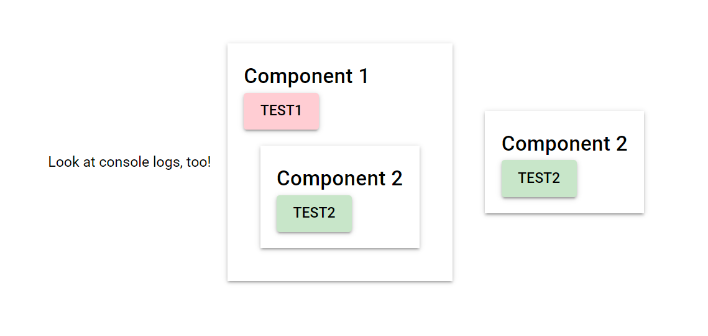

# Quasar App (eventbus)

A Quasar example Project for EventBus

<p align="center">
    
<p>

Watch an (component) event on page, root component or other component.

### More information
https://quasar.dev/quasar-utils/event-bus-util


## Install the dependencies
```bash
yarn
# or
npm install
```

### Start the app in development mode (hot-code reloading, error reporting, etc.)
```bash
quasar dev
```
